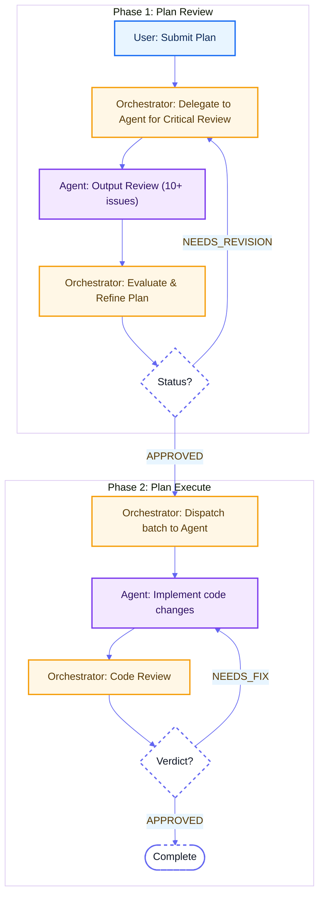

# AI Agent Skills

A collection of AI agent skills focused on testing, development, and engineering tasks. Built for developers who want AI coding agents to help with E2E testing, systematic learning, and code quality. Works with any agent that supports the Agent Skills spec.

Built by [Toan (zenji) Nguyen](https://zenstudio.cv)

Contributions welcome! Found a way to improve a skill or have a new one to add? Open a PR.

Run into a problem or have a question? Open an issue — we're happy to help.

## What are Skills?
Skills are markdown files that give AI agents specialized knowledge and workflows for specific tasks. When you add these to your project, your agent can recognize when you're working on a task and apply the right frameworks and best practices.

## 🚀 Active Skills
- **GitHub OS**: Set up GitHub as your project's Operating System - execution layer integrated with docs as knowledge layer, optimized for LLM workflows.
- **Playwright Extension Testing**: Gold-standard E2E for MV3/WXT extensions.
- **Peer LLMs**: Inter-LLM collaboration workflows — enables delegation, review, and execution across LLM providers.
  - **Codex CLI**: Delegates coding tasks to Codex CLI for batch refactoring, code generation, multi-file changes.
  - **OpenCode CLI**: Delegates coding tasks to OpenCode CLI with streaming JSON output and session reuse.
  - **Plan Review**: Reviews technical plans via a coding agent with iterative refinement.
  - **Plan Execute**: Executes finalized plans by delegating to a coding agent with Claude/codex orchestrator.
- **Lesson Decision Records**: Systematic recording of AI mistakes and learnings using ADR-inspired format.
- **Context Hub Get API Docs**: Fetch current API documentation for third-party libraries and SDKs via chub CLI.

## Installation

### Option 1: CLI Install (Recommended)
Use `npx skills` to install skills directly:

```bash
# Install all skills
npx skills add ZenStudioLab/skills

# Install specific skills
npx skills add ZenStudioLab/skills --skill lesson-decision-records
npx skills add ZenStudioLab/skills --skill get-api-docs

# List available skills
npx skills add ZenStudioLab/skills --list
```

This automatically installs to your `.agents/skills/` directory.

### Option 2: Clone and Copy
Clone the entire repo and copy the skills folder:

```bash
git clone https://github.com/ZenStudioLab/skills.git
cp -r skills/skills/* .agents/skills/
```

### Option 3: Git Submodule
Add as a submodule for easy updates:

```bash
git submodule add https://github.com/ZenStudioLab/skills.git .agents/zenstudiolab-skills
```
Then reference skills from `.agents/zenstudiolab-skills/skills/`.

## 🛠️ Usage
Integrated via [skills.sh](https://skills.sh).

Once installed, just ask your agent to help with tasks:

"Set up GitHub OS for this repository"
→ Uses GitHub OS skill

"Help me set up Playwright E2E testing for my MV3 extension"
→ Uses Playwright Extension Testing skill

"Delegate this refactoring to Codex CLI"
→ Uses Peer LLMs skill (Codex integration)

"/plan-review ./plans/my-feature.md"
→ Uses Peer LLMs skill (plan-review, defaults to codex)

"/plan-execute ./plans/my-feature.md"
→ Uses Peer LLMs skill (plan-execute, defaults to codex)

"/plan-review opencode ./plans/my-feature.md"
→ Uses Peer LLMs skill (plan-review, overrides to opencode)

"/plan-execute opencode ./plans/my-feature.md"
→ Uses Peer LLMs skill (plan-execute, overrides to opencode)

"Create a Lesson Decision Record for a recent bug"
→ Uses Lesson Decision Records skill

"Get the latest OpenAI API documentation"
→ Uses Context Hub Get API Docs skill

## Peer LLMs

Inter-LLM collaboration workflows — enabling AI agents to delegate, review, and execute tasks across different LLM providers.

### Skills

| Skill | Description | Trigger |
|-------|-------------|---------|
| **Codex CLI** | Delegates coding tasks to Codex CLI for execution. Great for batch refactoring, code generation, multi-file changes. | `ask_codex.sh "Your request"` |
| **OpenCode CLI** | Delegates coding tasks to OpenCode CLI for execution. Supports streaming JSON output with session reuse. | `ask_opencode.sh "Your request"` |
| **plan-review** | Reviews a technical plan via a coding agent (default: Codex) and iteratively refines it. Use `opencode` prefix to override provider. | `/plan-review [opencode] <plan-file-path>` |
| **plan-execute** | Executes a finalized plan by delegating coding to a coding agent (default: Codex). Claude orchestrates, agent codes, Claude reviews — iterating until quality passes. Use `opencode` prefix to override provider. | `/plan-execute [opencode] <plan-file-path>` |

### Workflow



### Core Concepts

| Concept | Description |
|---------|-------------|
| **Adversarial** | Coding agent acts as a "nitpicker" — its job is to find flaws |
| **Iterative** | Multiple rounds of back-and-forth until quality gates pass |
| **Role Separation** | User defines what, orchestrator (Claude/any LLM) coordinates how, coding agent executes |
| **Feedback Loops** | Review → Fix → Re-review cycles |
| **Provider Override** | Use `opencode` prefix to switch from default Codex to OpenCode |

### Three Loops

- **Loop A (Plan Refinement)**: Review finds issues → Refine plan → Re-review → APPROVED
- **Loop B (Code Fixing)**: Code review finds bugs → Agent fixes → Re-review → APPROVED
- **Loop C (Batch Processing)**: Complete current batch → Next batch → All done

## 🏗️ Structure
- `skills/`: Specialized skill packages.

## Contributing
Found a way to improve a skill? Have a new skill to suggest? PRs and issues welcome!

## License
MIT - Use these however you want.