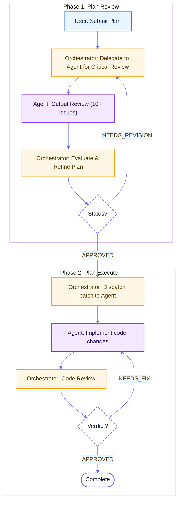

# OpenCode CLI — Peer LLM Coding Agent

Part of the [Peer LLMs](../README.md) skill for inter-LLM collaboration workflows.

## Overview

OpenCode is a free, open-source AI coding agent with broad model support (Claude, GPT, Gemini, and 75+ providers via Models.dev). Great for batch refactoring, code generation, multi-file changes, and multi-turn implementation tasks.

## Workflow

## Core Concepts

| Concept | Description |
|---------|-------------|
| **Adversarial** | Coding agent acts as a "nitpicker" — its job is to find flaws |
| **Iterative** | Multiple rounds of back-and-forth until quality gates pass |
| **Role Separation** | User defines what, orchestrator (Claude/any LLM) coordinates how, coding agent executes |
| **Feedback Loops** | Review → Fix → Re-review cycles |
| **Provider Override** | Use `opencode` prefix to switch from default Codex to OpenCode |

## Three Loops

- **Loop A (Plan Refinement)**: Review finds issues → Refine plan → Re-review → APPROVED
- **Loop B (Code Fixing)**: Code review finds bugs → Agent fixes → Re-review → APPROVED
- **Loop C (Batch Processing)**: Complete current batch → Next batch → All done

## Comparison with Codex

| Feature | OpenCode | Codex |
|---------|----------|-------|
| **Cost** | Free (open-source) | Paid |
| **Models** | 75+ providers | OpenAI only |
| **Protocol** | ACP (Agent Client Protocol) | JSON-RPC |
| **CLI** | `opencode run` | `codex exec` |
| **Session** | `--session <id>` | `--session <id>` |
| **File context** | `--file <path>` | `--file <path>` |
| **PTY workaround** | Not needed | Required |
| **Watch mode** | `--watch` streams to stdout | Not available |
| **Status tracking** | `.runtime/*.status` + `*.progress` | Not available |

## See Also

- [Codex CLI](../codex/README.md) — Alternative coding agent with OpenAI models
- [Plan Review](../plan-review/README.md) — Reviews plans via adversarial iteration
- [Plan Execute](../plan-execute/README.md) — Executes plans with orchestrator review
